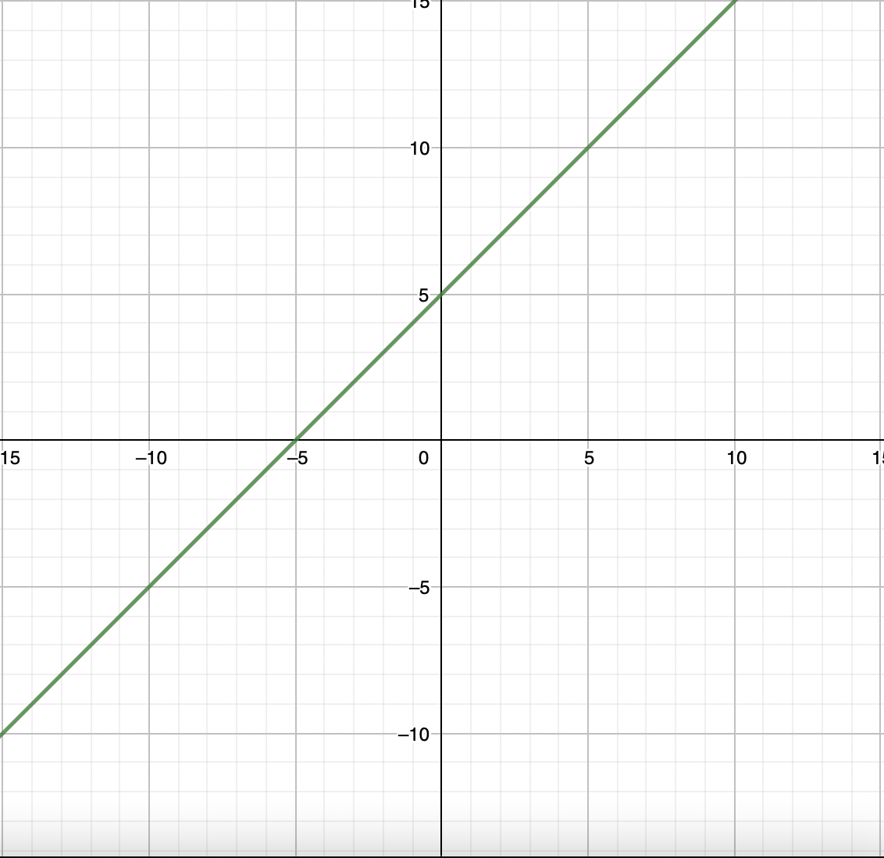

# Уравнение. Линейное уравнение. График уравнения.

Начнем курс школьной алгебры с понятия уравнения и линейного уравнения. 
Уравнением в математике называется равенство, в котором неизвестна одна или несколько величин.

Типичным примером простого уравнения является линейное уравнение. 
Почему оно так называется - рассмотрим в этом же уроке немного ниже. 

$$
\begin{align}
    2x + 5 = 13\\
    x + 1 = 0\\
    13d - 21 = 66
\end{align}
$$

Всё это - линейные уравнения. Общий же вид линейного уравнения таков:

$$
\begin{align}
    ax + b = c
\end{align}
где a, b и c - какие-то числа, а x - неизвестное. 
Линейное уравнение - это уравнение, в котором все неизвестные величины в первой степени (нет $x^2$ или $x^\frac{1}{2}$).

Решаются такие уравнения очень просто: достаточно перенести с левой части в правую 
число без неизвестной (константу, что изображена в общем виде лин. уравнения как b), 
сменив у нее знак (был +, стал -, и наоборот). 
Далее, вычислив значение выражения в правой части, разделить его на число возле неизвестной 
(коэффициент) - это и будет ответом.

Пример.

$$
\begin{align}
    12k - 18 = 15\\
    12k = 15 + 18\\
    12k = 33\\
    k = \frac{33}{12} = 2,75
\end{align}
$$

Поэтому я не люблю говорить слова “число перед x” или 
“коэффициент при x”, потому что вместо x может быть любая 
другая буква, обозначающая неизвестную.

Почему же уравнение называется линейным? Рассмотрим уравнение.

$$
\begin{align}
    x + 5 = y
\end{align}
$$

Оно является линейным, так как все величины находятся в 
первой степени. Что значит решить уравнение с одной 
неизвестной - понятно, но что значит “решить уравнение с двумя 
или несколькими неизвестными”? Необходимо найти совокупность всех 
решений данного уравнения. Какие решения есть у вышепредставленного 
уравнения (буду показывать их в форме (x; y))? 
Ну, например, (1; 6), (0; 5), (12; 17). 
А что будет, если в координатной плоскости xOy поставить все 
точки - решения этого уравнения?

Получится ни что иное, как прямая. 
Поэтому уравнение и называется линейным - 
график этого уравнения - прямая линия.

**Графиком уравнения** с двумя неизвестными называется 
совокупность точек в координатной плоскости xOy, являющихся 
решениями данного уравнения. На графике выше какую точку ни возьми - 
подставив ее координаты в уравнение вместо x и y соответственно - 
равенство будет верным.